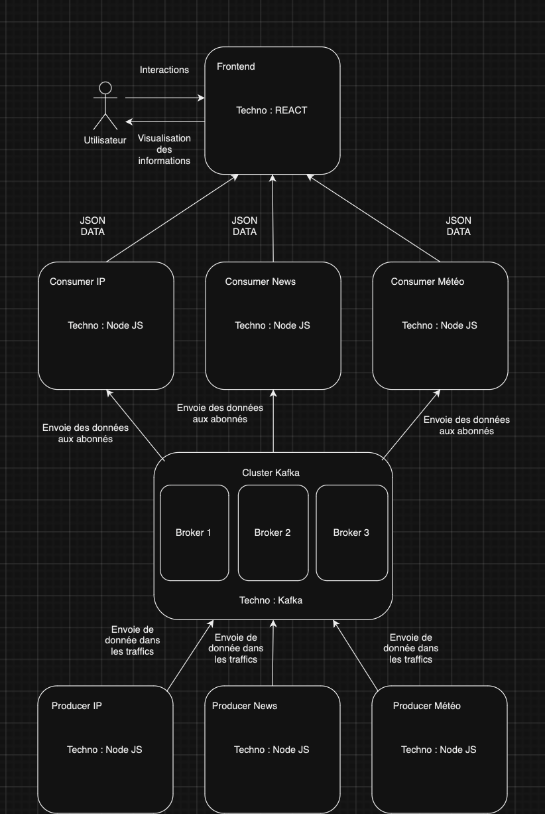
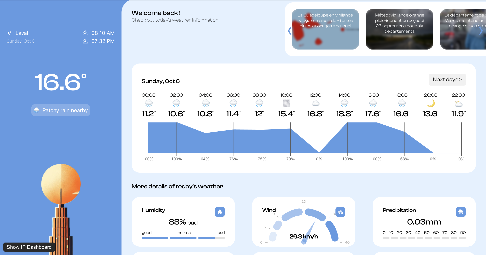
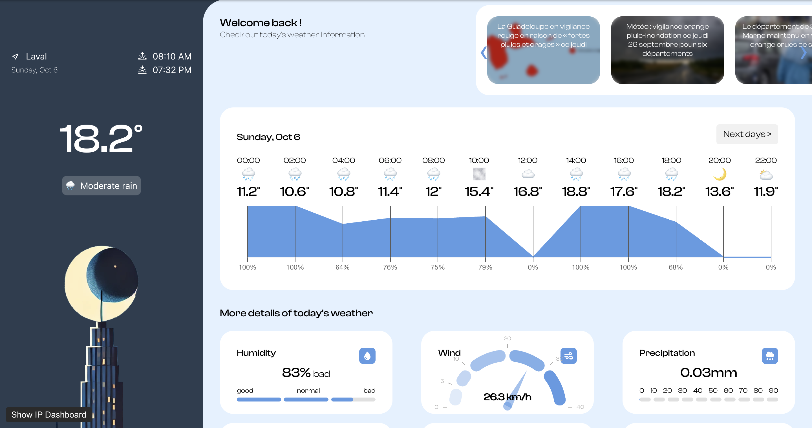
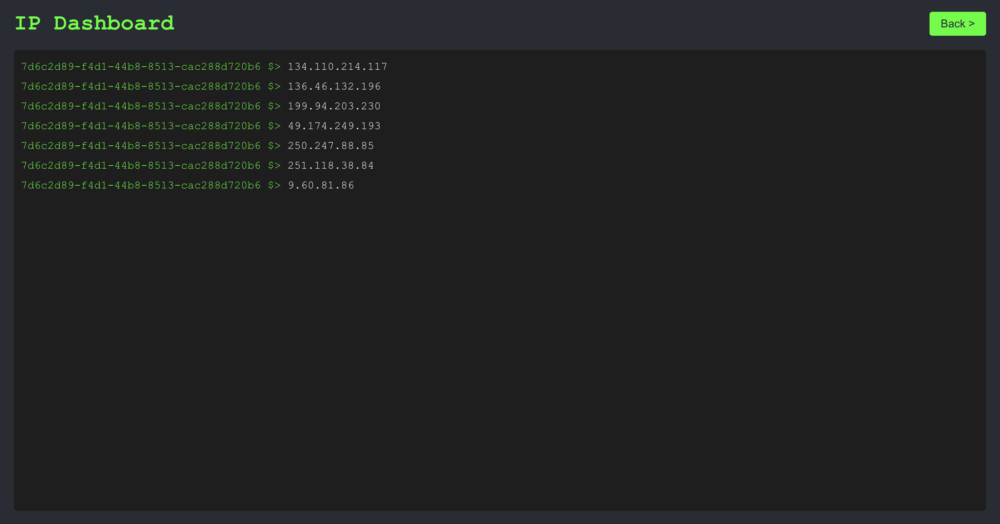

# Site de données en temps réel Kafka

## GROUPE

Produit par :
Jonas Cholet
Martin Ledroit
Alexis Avenel 
Nicolas Nadé 
Alexandre Bonadé

## SOMMAIRE

1. [Introduction](#introduction)
2. [Installation et Configuration](#installation-et-configuration)
3. [Utilisation du site](#utilisation-du-site)

## Introduction

Ce projet implémente des brokers Kafka pour envoyer des données de météo, des articles de presse sur la météo et des adresses IP en temps réel à une application web.
Nous pouvons afficher ces données en temps réel.

### Composants principaux

L'architecture du système se compose des éléments suivants :

1. Kafka :
   - Trois brokers de messages distribués qui gèrent la transmission et le routage des messages entre les producteurs et les consommateurs.

2. Backend :
   - Un serveur Node.js qui agit comme producteur et consommateur de messages.
   - Utilise WebSocket pour la communication temps réel entre les clients et le serveur.

3. Frontend :
   - Une application React qui sert d'interface utilisateur.
   - Affiche les informations de la météo reçue, permet de lire des articles de journaux et une page permettant d'afficher les adresses IP des connexions entrantes et sortantes.

### Objectifs

L’objectif principal de ce projet est de démontrer comment exploiter Kafka pour envoyer de nombreuses données. Plusieurs questions peuvent être soulevées comme :

- Comment concevoir les brokers kafka pour envoyer trois différents types de données ?
- Comment présenter les données côtés front ?
- Comment concevoir une application scalable ?
Grâce à Kafka et React, ces problématiques peuvent être résolues.

### Technologies utilisées

Le projet s’appuie sur une combinaison de technologies pour assurer une architecture robuste et scalable :

- Kafka : Pour envoyer en temps réel des données aux utilisateurs.
- Docker : pour conteneuriser l’environnement, simplifiant ainsi le déploiement sur différentes machines.
- React : Framework simplifiant l'utilisation combinée de HTML, CSS et JavaScript pour l'affichage du site.
- Chart.js : pour créer des visualisations interactives et dynamiques des données.
- faker-js : permet de générer des adresses IP aléatoires.
- NewsApi : permet de récupérer des articles de presse.
- WeatherApi : permet de récupérer des informations sur la météo.



## Installation et configuration

Cette section vous guide à travers les étapes simples pour installer et configurer l’environnement de ce projet. L’objectif est de rendre l’application opérationnelle localement via Docker, en quelques commandes seulement.

### Prérequis

Avant de commencer, assurez-vous que les éléments suivants sont installés sur votre machine :

- Docker : Docker est utilisé pour créer des conteneurs qui isolent les différents composants du projet. Installez [Docker](https://docs.docker.com/get-started/get-docker/)
- Docker Compose : Utilisé pour orchestrer et gérer les multiples conteneurs nécessaires pour exécuter le projet. Installer [Docker Compose](https://docs.docker.com/compose/install/)

### Installation

Étapes :

- Clonage du dépôt du projet :
  Ouvrez un terminal et exécutez la commande suivante pour cloner le dépôt du projet sur votre machine :
```
  git clone https://github.com/jcholet/Kafka-realtime-data-streaming-platform.git
```

- Accédez au répertoire du projet :
  Une fois le dépôt cloné, accédez au répertoire principal du projet en utilisant la commande cd :
```
  cd Kafka-realtime-data-streaming-platform
```
- Démarrez les services avec Docker Compose
  Pour lancer tous les services du projet (Hadoop, Backend, Frontend, etc.), exécutez simplement la commande suivante :
```
  docker-compose up
```
Cette commande télécharge les images Docker nécessaires, les construit si besoin, et démarre les conteneurs définis dans le fichier docker-compose.yml.


### Configuration

Le fichier docker-compose.yml configure tous les services nécessaires au projet. Voici un aperçu des principaux services :

- Cluster Kafka : Contient trois brokers qui sont lancés automatiquement. Ils communiquent entre eux pour traiter les données en temps réel.
- Backend : Ce service appelle les trois APIs décrites dans la partie technologies utilisées.
- Frontend : Ce service sert l’interface utilisateur pour visualiser les données.

Aucun fichier de configuration supplémentaire n’est requis pour le lancement du projet, tout est géré automatiquement par Docker et Docker Compose.

### Accès aux services

Une fois que Docker Compose a démarré tous les services, vous pouvez y accéder via les adresses suivantes :

- Frontend (interface utilisateur) : Disponible sur http://localhost:3000, cette interface permet de visualiser les données sous forme de graphiques et d’autres formats

### Arrêt des services

Pour arrêter tous les services, il suffit de revenir dans le terminal où docker-compose up a été lancé et d’utiliser CTRL + C. Vous pouvez également arrêter les conteneurs en arrière-plan avec la commande suivante :
```
docker-compose down
```
Cela arrête tous les conteneurs et libère les ressources utilisées.

Cette section vous donne une vue claire et concise des étapes d’installation et de configuration. Grâce à Docker, le déploiement est simple et ne nécessite que quelques commandes pour rendre l’application opérationnelle.

## UTILISATION DU SITE

Allez sur http://localhost:3000.

Le site contient une page d'informations sur la météo à Laval et quelques articles sur la météo en France. Il y a aussi une page qui permet de voir les (fausses) adresses IP qui se connectent et se déconnectent du site.
Voici à quoi devrait ressembler le site :

Quand il fait jour : 



Quand il fait nuit : 



La console des IPs



